# Udacity SDC Engineer - Capstone Project

### Team Fast and Furious: Carla Drift

#### Team members
- Gleb Podkolzin (lead) - `gpodkolzin@gmail.com`
- Ajith Raj - `ajith3530@gmail.com`
- Allen Hsu - `yhsu018@ucr.edu`
- David Altimira - `d_altimira@hotmail.com`
- Ming Wong - `mingyangwong@yahoo.com`

# General approach

The goal of the project is to control a car in simulated and real environments, which has to stop or go a maximum velocity based on the traffic lights that are placed around the environment.

The system of the vehicle is composed on three modules: (1) Perception, (2) Planning, and (3) Control. The main purposes of the project is to detect correctly traffic light signals and their state in the perception module and update the target waypoints in planning to make the car follow the given waypoints.

# Waypoint updater

The waypoint updater publishes at a frequency of 50hz. At every cycle, it sends a set number of waypoints ahead of the car to the `/final_waypoints` publisher. We chose 50 as the number of waypoints to balance performance in the simulator with driving accuracy.

When there is no stopline nearby, we simply publish these waypoints
 as given. However, if there is a stopline due to a combination of traffic light location and status (location received via the `/vehicle/traffic_lights` topic and impending red light detected in `tl_detector.py`), we adjust the velocity of the waypoints in order to bring the target velocity of the car down
  to `0` to have the car stop at or before the stopline.
  
Steering logic is done in `yaw_controller.py` and it is unchanged from the original code.

Throttle control done by `twist_controller.py` uses a [PID controller](https://en.wikipedia.org/wiki/PID_controller) and it is also mostly unchanged from the Udacity walkthrough videos as it seemed to behave OK enough.

# Traffic light detection

Traffic light detection is part of the perception module where the car can detect the nearest traffic light and its state (red, yellow and green). It is important to have a high degree of accuracy since failing to correctly detect a traffic light could cause an accident. Furthermore, it is important that the detection is efficient since a long delay could cause the car not to be able to stop in time and cause an accident as well.

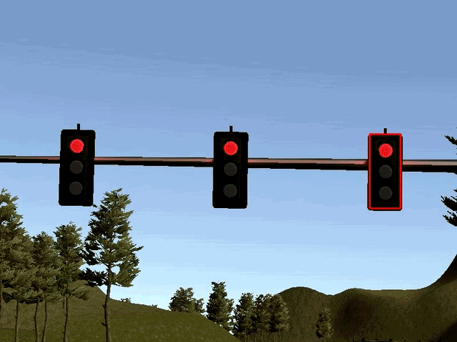

The traffic light detection receives images from the simulator or car. The `camera_info` publisher publishes the current camera image to the `/image_color` topic at 10hz. We subscribe to
`/image_color` inside the `tl_detector.py` node and cache the latest image received while detection happens out of sync with the camera image subscriber.

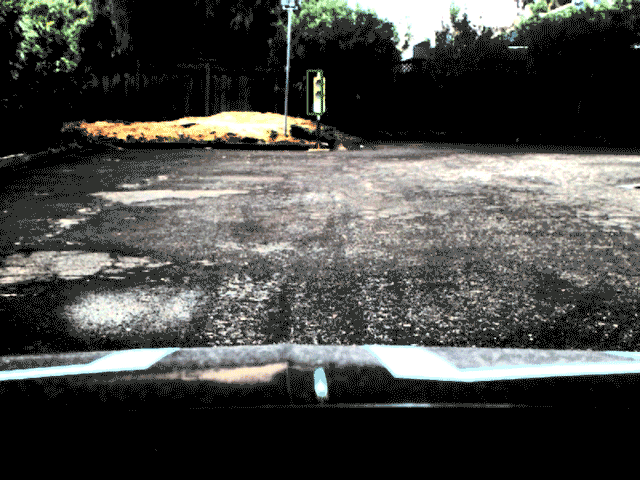

The goal of `tl_detector.py` is to perform the necessary image processing and publish the index of the waypoint closest to the next traffic light if the light status is red, or `-1` ("not found") if the nearest traffic light is yellow or red. This is done at a frequency of 10hz as well, chosen because that is the default rate of image publishing and is thus the theoretical maximum rate at which we can detect and classify traffic lights.

Luckily in the constrained environments of the simulator and the site, we do not need to worry about seeing multiple traffic lights with different statuses, or obstacles requiring lane changes or other pathfinding algorithms.

## Models and architectures explored

The selection of model and architecture is important as this influences the accuracy and efficiency in detecting traffic lights.

We considered different models and architectures:

- Faster-rcnn: this is a type of architecture/model that have two training phases. First it has a region proposal network to obtain the region of interest. In addition, it has a classification network.
- SSD (Single Shot Detection) architecture: Instead of having a two training phases, this type of architecture have just one training phase. Therefore, this architecture can be trained end-to-end.

Additionally, there are implementations of neural networks that are optimized to run efficiently on less powerful hardware. These are named MobileNets, which can be useful when image processing needs to be fast at the expense of accuracy.

Our approach was to reuse existing models from the TensorFlow detection model zoo <sup>[2]</sup>, a collection of detection models pre-trained on different datasets for the task of object detection. These pre-trained models were our starting point and we re-trained these models with various datasets.

The different models we aimed to re-train and evaluate their accuracy and performance were:

- ssd_inception_v2_coco
- ssd_mobilenet_v2_coco
- faster_rcnn_inception_v2_coco

After selecting the models we:

- Trained the different models using simulation and site data sets
- Evaluated accuracy and speed for each of these models by running inference through the ROS system as well as getting offline evaluation results through Python scripts (mostly in `./model-playground/CarND-capstone-model-playground.ipynb`)
- Selected a model
- Evaluated how we could improve the accuracy of the model selected by either tuning some of the parameters or feeding the training dataset with new images
- Froze the graphs and proceeded when the trained model was accurate and efficient enough

The exported graphs were the final ones used in the perception module.

## Settings of the models

Each model had particular settings (`.config` file) that we needed to tune. The different parameters that we adjusted:

- Model:
  - Set `num_classes` to 3 (red, yellow, green)
  - `max_detection_per_class` (default 100) and `max_total_detections` (default 300) to 10 and 10 respectively.
- `train_config`:
  - `fine_tune_checkpoints`: directory where the pre-trained model is placed
  - `num_steps`: typically 10000 or 20000
- `eval_config`:
  - `num_examples`: number of images in the evaluation data.
- `eval_input_reader` and `train_input_reader`:
  - `input_path` and `label_map_path` to the `images.record` files and `label_map.pbtxt` respectively.

## Datasets

The collection of datasets was one of the most fundamental tasks. A dataset that contains the necessary features along with different augmentations helps increase the model accuracy. Some desired characteristics of good dataset are:

1. Data should be well balanced ie., similar amount of sample data should be available for different classes to
 classify, such as roughly equal numbers of red, green and yellow traffic light images
2. The dataset should contain a good variety of data, such as taking traffic light images from different distances or different angles

Applying data augmentation by adjusting the horizontal/vertical orientation, rotation, brightness, zoom level, etc. can help the model generalize better without having to obtain additional data. Using good quality synthetic images can also be used to help SSD models achieve a higher degree of generalization<sup>[2]</sup>.

### Data augmentation

### Methodology to generate datasets

The simulator images were collected by directly running the vehicle in the simulator environment while using the `image_saver` tool from the `image_pipeline` ROS package to save images. The images collected were then labeled using the open source tool `labelImg`.<sup>[4]</sup>
The XML labels were used to create a csv file containing all the input image and their respective label details.<sup>[6]</sup> Once the csv file was generated, it was converted into TFRecord format, as that is the label input for the model training. <sup>[5]</sup>

### Simulation data

We used two different datasets. For training the models we used an external one [3]. For evaluating the model, we
 created another dataset that was generated with a script. This script started with a few background images created by erasing existing traffic lights with Photoshop, onto which it placed a random number of traffic light images at random locations with some random transformations such as rotation or scaling.

Labeled training image using labelImg:

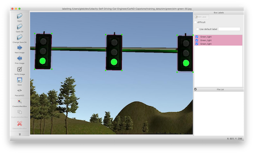

Synthetic image for evaluation:

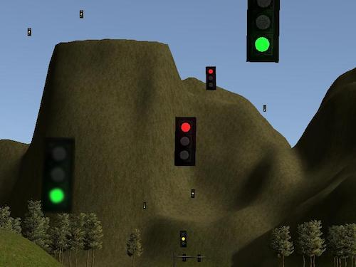

 The external dataset<sup>[3]</sup> used for training the simulator model was composed of 888 green lights, 1430 red lights, and 254 yellow lights.

### Site data

We tried several datasets for training the site models. One was a labeled set of images from the `traffic_light_training.bag` data set.

We also tried training with synthetic images created by amending one of these images with another instance of a traffic light:

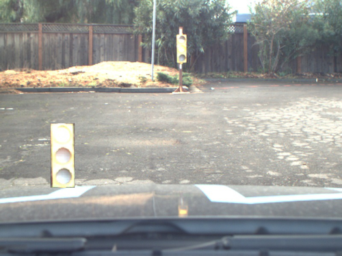

We also trained models using images created in a way similar to the synthetic simulator images - using a clean background with multiple traffic light images superimposed.

#### Image transformations

The training images were first contrast-adjusted using OpenCV by converting to the [LAB color space](https://en.wikipedia.org/wiki/CIELAB_color_space) and using the [CLAHE algorithm](https://en.wikipedia.org/wiki/Adaptive_histogram_equalization#Contrast_Limited_AHE) on the L channel. 

After contrast adjustment, the [gamma value](https://en.wikipedia.org/wiki/Gamma_correction) of each image was randomly varied between values of 0.4 to 0.6 to simulate changing light conditions (smaller gamma value means a darker image).

(1) Original example:

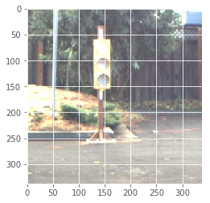

(2) Only adjusting gamma to 0.5 to improve traffic light visibility on the background

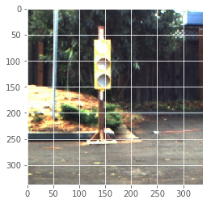

(3) Only contrast-adjusting via CLAHE on the L color channel (in LAB color space):

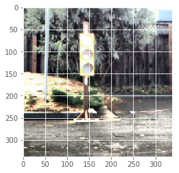

(4) Adjusting contrast first, gamma second:

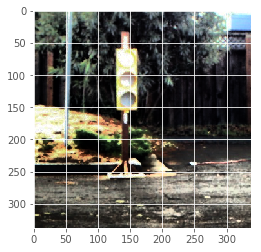

(5) Adjusting gamma first, contrast second:

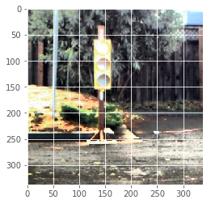

Changing contrast first and gamma second (sample 4) seemed to provide the most contrast and background separation for the traffic light images while preserving traffic light detail not seen on the original images, so this was the transformation chosen for both generating site training images as well as the inference code.

Example training images:

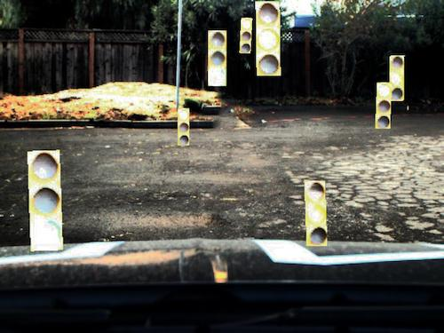

We generated 2000 such images with 4002 red, 4010 yellow, and 3943 green lights in total.

## Results of the model analysis

We used different models with different steps, and we evaluated the performance based on four categories:
- **Correct**: If the traffic light is detected and labelled correctly.
- **Incorrect**: If the traffic light is detected and labelled incorrectly.
- **Not Detected**: If the traffic light is not detected.
- **Background**: If we detect a traffic light where there is no traffic light (e.g. somewhere on the background image).

### Models trained with simulator data

As we can see in the below picture, the fast_rcnn_inception_v2 with 10000 steps performed better than the other models, and these other models performed quite similarly in terms of accuracy. We can also observe that there were just few traffic lights that were detected incorrectly but there were quite a few traffic lights that were not detected detected.

Another observation is that the models detected better red lights than the other lights. This is probably owing to the fact that the trained dataset had more red lights.

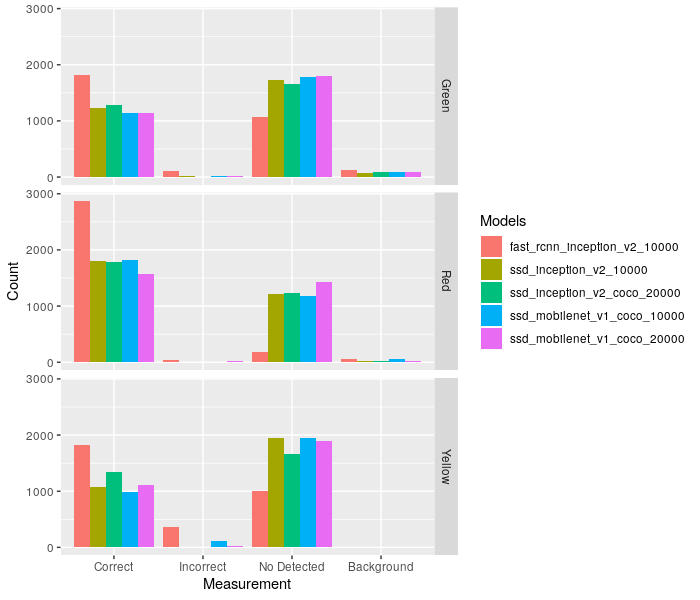

We also measured the efficienty (i.e. the amount of time each model took to process and evaluate each image).

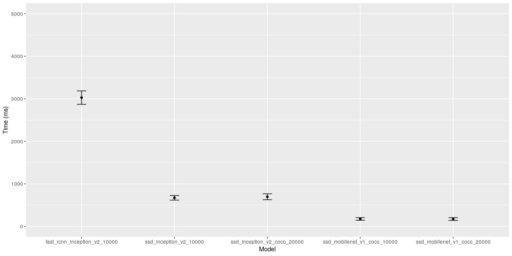

We can see that the fast_rcnn_inception_v2 was quite slow and the fasted model was the ssd_mobilenet. Although the fast_rcnn was the more accurate model, we decided to discard it because of its slowness. Since all the other models performed similary, we chose the fastest model, `ssd_mobilenet_v1_coco_20000`.

To further analyse the selected model, we also decided to evaluate its performance for different traffic light sizes. We thought this could inform whether the model detected better some sizes than others and thus inform how we could best retrain this model with more data.

We decided to have 10 categories of bounding boxes sizes. We defined the size as `$size = width * height$`. To obtain the range of traffic light sizes for each category, we calculated the maximum size and the minimum size of the traffic lights in our evaluation data set. Then, we calculated the range size for each category as `$range_size=\frac{(max_size-min_size)}{10}$`. So the first category in the graph (category 0) had the following range: `[min_size, min_size+range_size]`. The last
 category had `[max_size-range_size, max_size]`.

 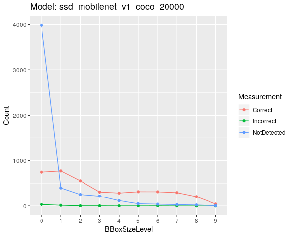

 Although the model performed well in detecting correctly the traffic lights in general, it had some problems in detecting the smallest sizes. This could also explain why we have seen quite a few traffic lights undetected. One explanation for this is that our evaluation script produced too small traffic lights that the model was not trained for. We did not consider this as a big concern as if we miss a traffic light that is far away from the car, this would not cause any problem as long as we detect it as we get closer to it and we have enough time to stop.

### Models trained with site data

We evaluated three models shown in the below pictures. These were:

- ssd_inception_v2_coco_10000
- ssd_mobilenet_v1_coco_20000_gamma
- ssd_mobilenet_v1_coco_40000

The difference between these three models were the number of steps and the datasets used for training. The ssd_mobilenet_v1_coco_20000_gamma performed better as was the only one trained with synthetic images generated by a script and thus this model could see a larger variety of traffic lights.

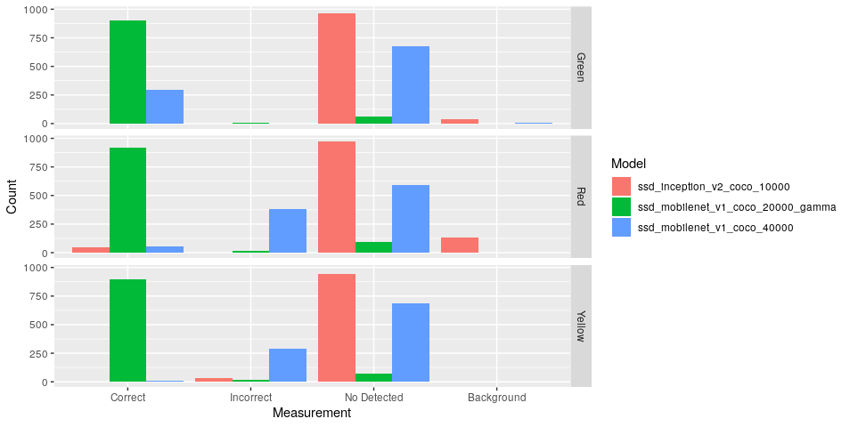

We also observed that by adjusting the gamma in the different images influenced how well the models performed. That is why we used another test set to be able to adjust the gamma parameter for the `ssd_mobilenet_v1_coco_20000_gamma` model. The results are below.

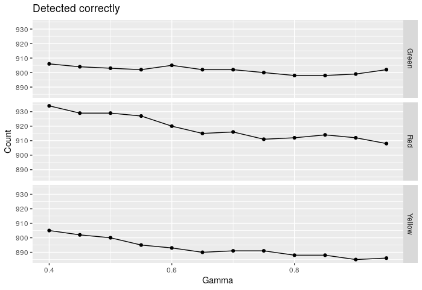

We decided to adjust the gammma parameter to 0.4 as this showed better results.

Finally, we evaluated the final model with an evaluation data set (real data - not generated by a script).

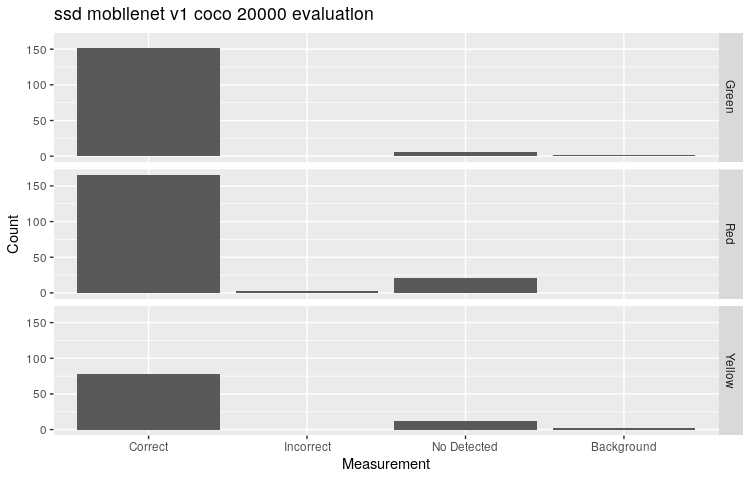

We can see that the model performed very well in detecting all the lights.

## Implementation adjustments

Since we wish to publish the latest stopline at a frequency of 10hz and the neural network takes longer than 100msec to return
 results, at every cycle we set a boolean to track if we are currently processing an image. This way we can skip processing new images until the last detection cycle completes, so that each detection cycle uses the latest image and there is less chance of lag due to triggering a new detections before the previous one completes. If detections are triggered while another image is being processed, we get stale results that mess up car behavior.

Additionally, for each detected traffic light state, we use several techniques to filter out possible noise:

- Only using detections with a confidence level higher than `0.5`
- Waiting until we identify the same state at least 3 times before updating the prediction

 Both of these techniques guard against unpredictable behavior due to errors in detection. For the second method, 3
 was a number chosen to balance our confidence in the prediction with reacting quickly enough to changing conditions.

Another byproduct of slow detection speeds is the possibility of the car seeing a yellow light and
 interpreting it too slowly, allowing the light to turn red and causing the car to run the red light. With 3 cycles to
 update predictions, the worst case is ~4 detections, because the light can change in the next frame after the
 previous cycle of detection kicked off.

To solve this, we assume the next stopline applies unless either:
- we see a `green` light or
- we identify a `yellow` light and we are close enough to it to exclude the possibility of the light turning red
 before we cross the line.

This ensures that in the worst case scenario, the car will always stop at the next stopline (assuming it is not mis-detecting red lights as green).

# Future work
- More carefully tune the sim model to detect smaller traffic lights so that we do not miss these traffic lights in our detection.
- Tune the site model to detecti traffic lights up close better. One approach would be to generate more training data with larger traffic lights to improve this performance.

# How to use the Python notebook inside `model-playground`

Create a `conda` env
```
cd model-playground/
conda env create -f environment.yml
```

Activate environment

```
conda activate carnd-capstone
```

Run notebook

```
jupyter notebook
```

Some of the python notebook code assumes certain directory structures on the user's machine, so you may need to create certain directories or substitute your own `frozen_inference_graph.pb` files for your chosen model(s).

# How to run ROS code with the sim or site training data

### Native Installation

* Be sure that your workstation is running Ubuntu 16.04 Xenial Xerus or Ubuntu 14.04 Trusty Tahir. [Ubuntu downloads can be found here](https://www.ubuntu.com/download/desktop).
* If using a Virtual Machine to install Ubuntu, use the following configuration as minimum:
  * 2 CPU
  * 2 GB system memory
  * 25 GB of free hard drive space

  The Udacity provided virtual machine has ROS and Dataspeed DBW already installed, so you can skip the next two steps if you are using this.

* Follow these instructions to install ROS
  * [ROS Kinetic](http://wiki.ros.org/kinetic/Installation/Ubuntu) if you have Ubuntu 16.04.
  * [ROS Indigo](http://wiki.ros.org/indigo/Installation/Ubuntu) if you have Ubuntu 14.04.
* [Dataspeed DBW](https://bitbucket.org/DataspeedInc/dbw_mkz_ros)
  * Use this option to install the SDK on a workstation that already has ROS installed: [One Line SDK Install (binary)](https://bitbucket.org/DataspeedInc/dbw_mkz_ros/src/81e63fcc335d7b64139d7482017d6a97b405e250/ROS_SETUP.md?fileviewer=file-view-default)
* Download the [Udacity Simulator](https://github.com/udacity/CarND-Capstone/releases).

### Docker Installation
[Install Docker](https://docs.docker.com/engine/installation/)

Build the docker container
```bash
docker build . -t capstone
```

Run the docker file
```bash
docker run -p 4567:4567 -v $PWD:/capstone -v /tmp/log:/root/.ros/ --rm -it capstone
```

### Port Forwarding
To set up port forwarding, please refer to the "uWebSocketIO Starter Guide" found in the classroom (see Extended Kalman Filter Project lesson).

### Usage

1. Clone the project repository
```bash
git clone https://github.com/udacity/CarND-Capstone.git
```

2. Install python dependencies
```bash
cd CarND-Capstone
pip install -r requirements.txt
```
3. Make and run styx
```bash
cd ros
catkin_make
source devel/setup.sh
roslaunch launch/styx.launch
```
4. Run the simulator

### Real world testing
1. Download [training bag](https://s3-us-west-1.amazonaws.com/udacity-selfdrivingcar/traffic_light_bag_file.zip) that was recorded on the Udacity self-driving car.
2. Unzip the file
```bash
unzip traffic_light_bag_file.zip
```
3. Play the bag file
```bash
rosbag play -l traffic_light_bag_file/traffic_light_training.bag
```
4. Launch your project in site mode
```bash
cd CarND-Capstone/ros
roslaunch launch/site.launch
```
5. Confirm that traffic light detection works on real life images

### Other library/driver information
Outside of `requirements.txt`, here is information on other driver/library versions used in the simulator and Carla:

Specific to these libraries, the simulator grader and Carla use the following:

|        | Simulator | Carla  |
| :-----------: |:-------------:| :-----:|
| Nvidia driver | 384.130 | 384.130 |
| CUDA | 8.0.61 | 8.0.61 |
| cuDNN | 6.0.21 | 6.0.21 |
| TensorRT | N/A | N/A |
| OpenCV | 3.2.0-dev | 2.4.8 |
| OpenMP | N/A | N/A |

# References

<sup>[1]</sup> [https://anyverse.ai/2019/06/19/synthetic-vs-real-world-data-for-traffic-light-classification](https://anyverse.ai/2019/06/19/synthetic-vs-real-world-data-for-traffic-light-classification)

<sup>[2]</sup> [https://github.com/tensorflow/models/blob/master/research/object_detection/g3doc/detection_model_zoo.md  ](https://github.com/tensorflow/models/blob/master/research/object_detection/g3doc/detection_model_zoo.md  )

<sup>[3]</sup> [https://github.com/alex-lechner/Traffic-Light-Classification#linux](https://github.com/alex-lechner/Traffic-Light-Classification#linux)

<sup>[4]</sup> [https://github.com/tzutalin/labelImg](https://github.com/tzutalin/labelImg)

<sup>[5]</sup> [https://github.com/datitran/raccoon_dataset](https://github.com/datitran/raccoon_dataset)

<sup>[6]</sup> [https://pythonprogramming.net/creating-tfrecord-files-tensorflow-object-detection-api-tutorial  ](https://pythonprogramming.net/creating-tfrecord-files-tensorflow-object-detection-api-tutorial  )
